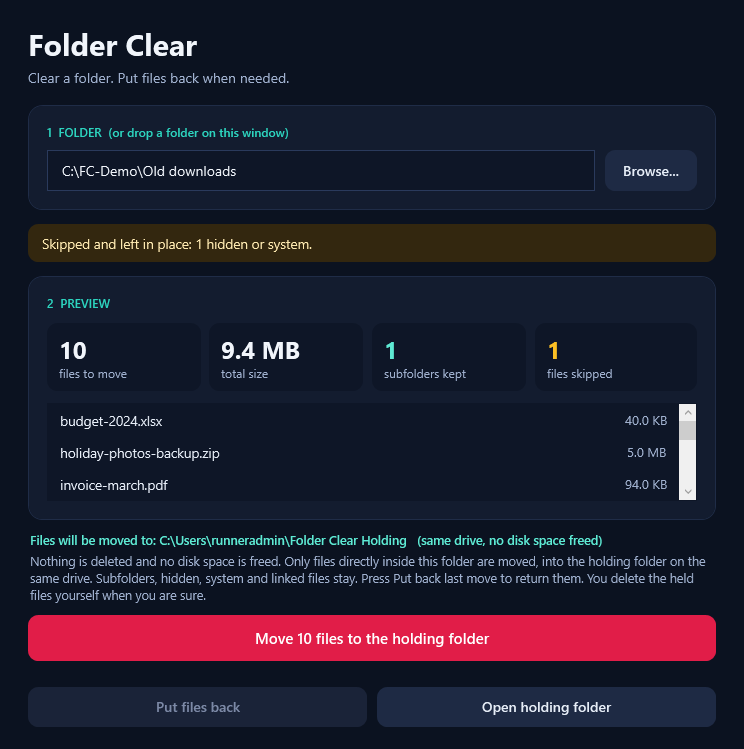

# Folder Clear

**Clear a folder. Put files back when needed.**

A small Windows app. You pick a folder, it shows you exactly which files are in it, and after you confirm it moves those files out of the folder into a holding folder. **Nothing is deleted**, and a button puts the files back.

## Use it

1. Download this repository as a ZIP (green **Code** button, then **Download ZIP**) and extract it.
2. Double-click **Start-FolderClear.cmd**.
3. Click **Browse...**, or drop a folder onto the window, or paste a path and press Enter.
4. Read the preview. It lists every file that will move, the total size and how many subfolders will be left alone. It also shows where the files will go.
5. Click the red button, then confirm.
6. Changed your mind? Click **Put back last move**.

Windows may show a SmartScreen warning because the files are not signed. If you downloaded the ZIP, you can right-click it, open **Properties** and tick **Unblock** before extracting. The scripts are plain text, so you can read them first.

Requirements: Windows 10 or 11 with the built-in Windows PowerShell 5.1. Nothing to install.

## Important: this does not free disk space

The files are moved, not deleted, so the folder is cleared but the space on your drive is still used. When you are sure you do not need the held files, delete them yourself in File Explorer (they are in the holding folder, see below). The app never deletes anything. There is no delete code in it at all.

## Where the files go

Into a dated folder inside the **holding folder**, on the same drive as the folder you chose, so the move is an instant rename (nothing is copied):

- On the drive that holds your Windows profile (normally C:): `C:\Users\<you>\Folder Clear Holding\<date and time>\`
- On any other built-in drive: `X:\Folder Clear Holding\<date and time>\`

Each batch folder contains your files, a `manifest.json` listing every file and the folder it came from (written before the first file moves), and a short `READ ME.txt`. **Open holding folder** in the app shows it in Explorer.

## What it will and will not do

| It does | It does not |
| --- | --- |
| Move the files directly inside the folder you chose | Open or change subfolders, or anything inside them |
| Move them by renaming on the same drive, never copy, never overwrite | Delete anything, empty anything, or use the Recycle Bin |
| Re-check the folder just before moving, and stop if it changed since the preview | Touch hidden files, system files, shortcuts or links (they are counted as skipped) |
| Refuse drive roots, Windows, Program Files, ProgramData, AppData and your user, Desktop, Documents, Pictures, Music and Videos root folders | Work on network drives, USB drives or folders reached through a link or junction |
| Leave a file where it is if it is in use, or if something goes wrong | Follow links out of the folder |

Put files back:

- **Put back last move (N files)** returns the files of the most recent move to the folder they came from. Press it again for earlier moves.
- A file is never overwritten. If a file with the same name is already in the original folder, that file stays in the holding folder and the app tells you.
- If the original folder is gone or no longer allowed, nothing moves and the files stay safe in the holding folder.

If something goes wrong half way (the app closes, the PC stops), the files already moved are in the batch folder and `manifest.json` lists all of them, so you can always find them or use **Put back last move**.

Limits worth knowing:

- Moving needs the holding folder to be creatable. If it cannot be created, nothing moves.
- The check that the folder is not a link happens before and during the move. A folder swapped for a link in the tiny gap between the check and one single file move cannot be ruled out. The move only renames files inside folders you chose, and never deletes.
- Moving a file keeps its contents byte for byte (the test checks this) but Windows may change its "last accessed" time.
- Files that are open in another program stay where they are.

## How it is built

- `FolderClear.ps1` is the whole app: the safety checks and the window (WPF, dark theme).
- `Start-FolderClear.cmd` starts it without a console window.
- `tests/Test-FolderClear.ps1` checks the safety rules.

Files are moved with the Windows `MoveFileEx` call with no flags, so it cannot overwrite and cannot fall back to copy-and-delete across drives: it renames or it fails.

## Testing, and what has not been tested

The safety tests and the screenshots run in GitHub Actions on a real Windows machine (`windows-latest`, which is Windows Server) using only throwaway files the test creates. They check that the refused folders are refused, that links, junctions, hidden files, system files and subfolders are left alone, that moved files arrive byte for byte in the holding folder with a correct manifest, that putting back works and never overwrites, that a locked file, a name clash, a holding folder that cannot be created, a holding folder behind a junction and a move to another drive all fail safely without losing or copying anything, and that the app source contains no delete code. The workflow runs only when you start it by hand.

It has not been run on a Windows 10 or 11 desktop by the author. The Browse dialog, the confirmation boxes and the Open holding folder button are the parts the automated run does not click through. Try it first on a folder of copies.

The screenshots in `docs/screenshots` are rendered from the real window by that test run, using a made-up demo folder.

## Licence

No licence has been added. Until the owner adds one, the default copyright rules apply.
